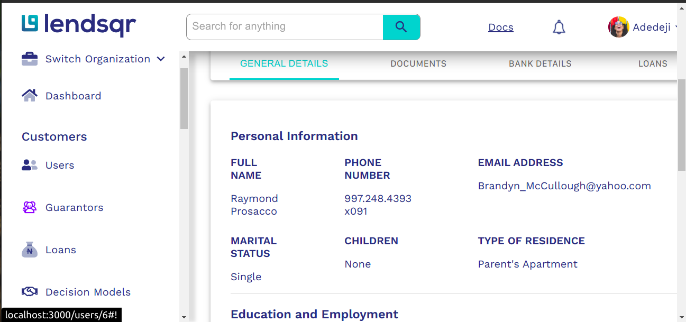

# Lendsqr Test Application: Frontend Test

This project was built to test my front end development skills.

## Screenshots



## Run Locally

Clone the project

```bash
  git clone https://github.com/The-Professor99/lendsqr-fe-test.git
```

Go to the project directory

```bash
  cd lendsqr-fe-test
```

Install dependencies

```bash
  npm install
```

Start the server

```bash
  npm start
```

## Running Tests

To run tests, run the following command

```bash
  npm run test
```

## 🔗 Links

- Live Site URL: [The app is hosted here.](https://ihechi-festus-lendsqr-fe-test.netlify.app/)

## Tech Stack

**Client:** React, Typescript, Redux, MaterialUI

## Features

- Login: Enter any email address(or what looks like one) and any password(as long as it's not rejected) to login. Login details are saved to LocalStorage.
- Logout: Click on the `Logout` button on the sidebar to logout. This returns you to the login page.
- AuthGuard: To access the main pages of the application, you have to be logged in. This prevents unauthenticated users from accessing the protected pages.
- Fake backend: This serves as the backend server of the application. It currently only serves to authenticate users logging in to the site and should be replaced by a real backend In real life scenarios.
- Table Functionalities: All sorts, paginations, rows to view per page, filters and resets on the table work accordingly.
- The search bar searches items on the datatable and returns rows with values that match the search text.
- Some tests have been set up.
- Login and Logout make use of localstorage.
- The datatable, filters and search box make use of redux for statemanagement.
- A simple `notfound` page is also set up.

## Authors

- [@The-Professor](https://ihechifestus9.web.app/)
